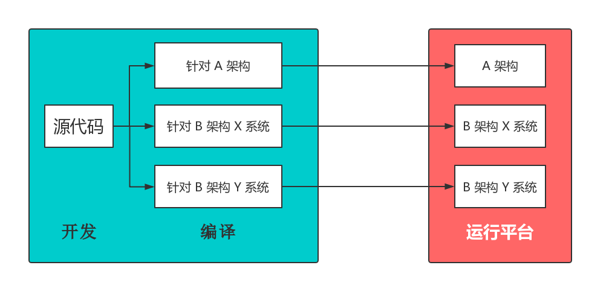
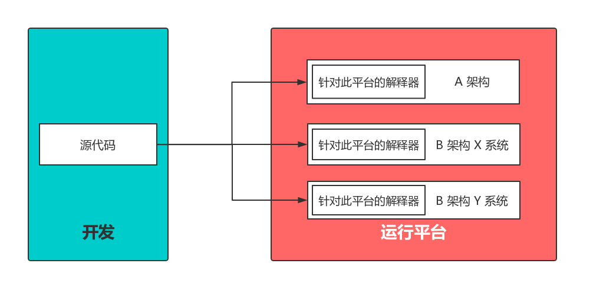
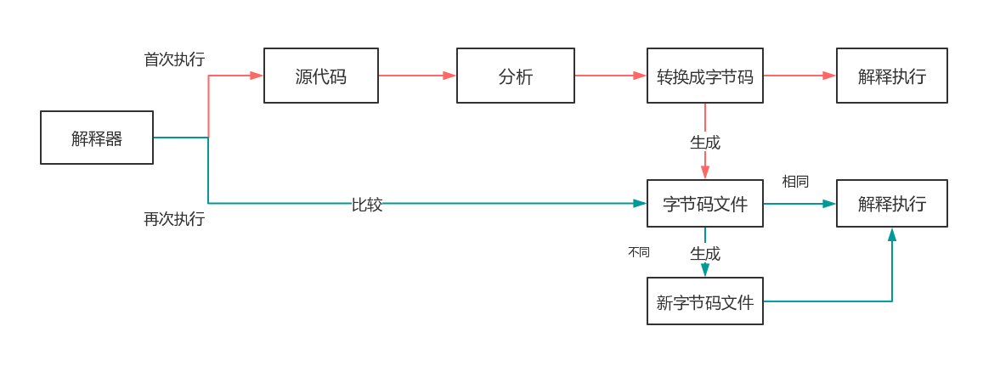
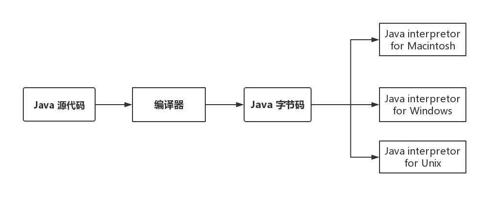

## 为什么 Java 被称作是“平台无关的语言”？

讨论 Java 的跨平台性就免不了要提及 JVM，不过在此之前我会先介绍一些编译方面的知识。

我们都知道，`机器语言`可以在计算机的 CPU 上直接执行。不过，机器语言并不符合人类的思考方式，难以阅读和编写，所以几乎所有的程序都是用 Java、Pascal 或 C++ 等`高级编程语言`编写的。当然，高级编程语言并不能由机器直接执行，它必须经过一系列操作转变成机器语言，为此，科学家们想出了一系列的解决方案。

### 编译型语言

首先是大家正在学习（或学习过）的编译型语言，代表有 C、C++ 等，它们的优点是执行速度快，不过需要编译器的编译。在编译过程中，目标代码要和机器的 CPU 架构相匹配，库文件要和操作系统相匹配，因此它们不适合跨平台。

举一个比较贴近生活的例子。

一名会多国语言的中国老师教了很多外国学生，这些学生分别来自英国、美国、德国、韩国。

当这名老师要给这些学生发放学习资料的时候，必须将中文资料翻译成不同国家的版本，再发放给学生阅读。

虽然**每种语言的翻译过程很快**，但整个翻译的工作非常繁琐，不仅要翻译成每个国家的语言，还要考虑美式英语和英式英语的差异，尽管它们的差异不是特别明显。而且，每次更新资料还要重新翻译一遍。

在这个例子中，中国老师就像是编译型语言的开发人员，中文资料就是编译型语言中的源代码，翻译后的资料就是不同 CPU 架构的机器语言，不同语言的学生就是不同 CPU 架构（X86、ARM 等）的机器，美国和英国的学生就是 CPU 架构相同但操作系统不同（Unix、Windows 等）的机器。

像中国老师一样，**编译型语言开发人员在不同平台执行代码时需要手动处理一些差异**，比如修改代码、安装不同的编译器等。

### 解释性语言

这位累得要死的中国老师，开始想办法。

他想，为什么我要自己翻译，**给他们每人一个自动翻译的软件不就好了**？

于是，老师就给每个学生定制了一个自动翻译软件，这个软件**不需要一次性翻译整个资料**，学生翻看某一页资料时，软件能及时将其翻译出来就好。

这便是早期的解释器，它的工作流程为：源代码（source code） -> 解释器（interpreter）。

因为解释器要**边解释边执行**，所以速度比编译器慢，不过开发者可以只关注代码编写，源代码到机器语言的转变交给运行平台处理，也就是一套代码几乎可以在所有平台运行。

这种类型的语言称作是`解释性语言`，其代表有 Python、JavaScript、Lisp 等。

当引入了编译型语言和解释性语言后，我们继续看例子。

老师虽然给学生定制了翻译软件，但是发现这个软件翻译每页内容都很慢，究其原因，这个软件需要先把每页内容分析一遍，将内涵复杂的中文（比如成语）转换成简单的中文，再进行向其他国家语言的翻译。

看到这个问题后，软件的提供商想出了一个解决方案。

在第一次打开资料时，让翻译软件把原始资料完整的进行分析转换，**保存成一个能够直接翻译的中间文件**（没有内涵复杂的中文）；然后，翻译程序再一页一页地读取转换后的中间文件去翻译。这样的话，虽然第一次打开时慢了些，但是当学生再次打开资料时，只要原始资料没有更新，就**直接通过保存的中间文件进行翻译**，速度会有很大提升。

当然，程序打开时，需要对比一下原始资料是否和中间文件一致，如果有修改的话，则再次编译出新的中间文件，覆盖旧的中间文件。

Python 程序运行时，就像上面的例子一样，现将源代码完整的进行转换，编译成更有效率的`字节码`，保存成后缀为“.pyc”的字节码文件，然后，解释器再通过这个文件一句一句翻译为机器语言去执行。

### Java 虚拟机

对于同一个问题总是有不同的解决方案。老师亲自翻译效率高但不能同时翻译成多种语言，自动翻译软件可以针对自己的语言翻译不过效率较低。

那么有没有一个折中的方法呢？我们思考一下上文中提到的“中间文件”的思想是否还能优化的更好，对于材料中内涵复杂的中文，如果老师将它们译为简单的句子（比软件自己简化效率更高），再交由自动翻译软件翻译，不就能协调共用两者的优点了吗？

这便是 Java 虚拟机的核心思想。

Java 的设计者选择使用编译和解释的组合。

用 Java 编写的程序首先被编译成机器语言（.class 文件），但它是一种不存在于计算机上的机器语言。这种所谓的“虚拟”计算机称为 Java 虚拟机，Java 虚拟机的机器语言称为 Java 字节码。（事实上，Sun Microsystems -- Java 的创始人已经开发出了运行Java字节码作为其机器语言的 CPU。）

然后 Java 字节码文件交由针对不同平台的解释器解释，这一步实现了 Java 的跨平台特性。

所以说，JVM 是一个“桥梁”，是一个“中间件”，**Java代码首先被编译成字节码文件，再由JVM将字节码文件翻译成机器语言**，从而达到运行Java程序的目的。

也正是 JVM，才使得 Java 语言可以兼具高效率和跨平台两种优点于一身。

